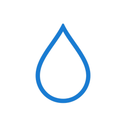

<p align="center">
  
</p>

<h1 align="center">go-hydrawise</h1>
<h3 align="center">go-hydrawise is a Go module for interacting with the Hydrawise™️ API.</h3>
<p align="center">
  
  <a href="https://github.com/401unauthorized/go-hydrawise#readme" target="_blank">
    
  </a>
  <a href="https://github.com/401unauthorized/go-hydrawise/graphs/commit-activity" target="_blank">
    
  </a>
  <a href="https://github.com/401unauthorized/go-hydrawise/graphs/commit-activity" target="_blank">
    
  </a>
  <a href="https://github.com/401unauthorized/go-hydrawise/blob/master/LICENSE" target="_blank">
    
  </a>
  <a href="https://paypal.me/stephenmendez401" target="_blank">
    
  </a>
</p>


## 📋 Table of Contents

- [Overview](#-overview)
- [Features](#-features)
- [Installation](#-installation)
- [How to Use the Client](#-how-to-use-the-client)
- [Contributing](#-contributing)
- [Supporting Developers](#-supporting-developers)
- [License](#-license)


## 👀 Overview

This Go module provides a client for interacting with the Hydrawise API. It allows users to manage and control irrigation systems by performing actions such as fetching zone schedules, running or stopping zones, and retrieving customer details.


## 🎛 Features

- Fetch zone schedules and statuses.
- Retrieve customer and controller details.
- Start or stop individual zones.
- Run all zones for a specified duration.


## 💾 Installation

To use this module, add it to your project using `go get`:

```bash
go get github.com/401unauthorized/go-hydrawise
```


## 🔌 How to Use the Client

Create a new client using your Hydrawise API key:

```go
package main

import (
	"fmt"
	"log"

	"github.com/401unauthorized/go-hydrawise"
)

func main() {
	apiKey := "your-api-key"
	client := hydrawise.NewClient(apiKey, nil) // Use nil for the default HTTP client

	// Example: Fetch customer details
	customerDetails, err := client.GetCustomerDetails()
	if err != nil {
		log.Fatalf("Error fetching customer details: %v", err)
	}
	fmt.Printf("Customer ID: %d\n", customerDetails.CustomerID)
}
```

### API Methods

#### Fetch Zone Schedules

```go
status, err := client.GetStatusSchedule(nil) // Pass a controller ID or nil for default
if err != nil {
	log.Fatalf("Error fetching status schedule: %v", err)
}
fmt.Printf("Next Poll: %d\n", status.NextPoll)
```

#### Run a Zone

```go
response, err := client.RunZone(1, 60) // Run zone 1 for 60 seconds
if err != nil {
	log.Fatalf("Error running zone: %v", err)
}
fmt.Println(response.Message)
```

#### Stop a Zone

```go
response, err := client.StopZone(1) // Stop zone 1
if err != nil {
	log.Fatalf("Error stopping zone: %v", err)
}
fmt.Println(response.Message)
```

#### Run All Zones

```go
response, err := client.RunAllZones(120) // Run all zones for 120 seconds
if err != nil {
	log.Fatalf("Error running all zones: %v", err)
}
fmt.Println(response.Message)
```

### Error Handling

The module returns Go `error` types for any issues encountered during API calls. Common errors include:

- `ErrNilClient`: Returned when the client is nil.
- HTTP errors with non-200 status codes.


## 🤝 Contributing

Contributions, issues and feature requests are welcome!

Feel free to check [issues page](https://github.com/401unauthorized/go-hydrawise/issues). You can also take a look at the [contributing guide](https://github.com/401unauthorized/go-hydrawise/blob/main/CONTRIBUTING.md).


## 😃 Supporting Developers

Give a ⭐️ if this project interests you!

Consider making a donation of any amount!

<a href="https://paypal.me/stephenmendez401" target="_blank">
  
</a>


## 📝 License

Copyright 2025 Stephen Mendez

Licensed under the Apache License, Version 2.0 (the "License");
you may not use this file except in compliance with the License.
You may obtain a copy of the License at

http://www.apache.org/licenses/LICENSE-2.0

Unless required by applicable law or agreed to in writing, software
distributed under the License is distributed on an "AS IS" BASIS,
WITHOUT WARRANTIES OR CONDITIONS OF ANY KIND, either express or implied.
See the License for the specific language governing permissions and
limitations under the License.


**Trademark Notices**

- **Hydrawise** is a trademark of Hunter Industries, Inc.

All other trademarks referenced herein are the property of their respective owners. go-hydrawise is not affiliated with or endorsed by the trademark holders.